# cml-yanxuan
仿网易严选demo

# 使用

- clone 当前项目
- 在项目根目录执行`npm install`
- 启动项目`cml dev`

其中地图功能 `./map/components/map` 使用了多态组件

# 页面如下

| web   |      微信小程序      |  native-weex | 百度小程序 | 支付宝小程序 |
|:----------:|:-------------:|:------:|:------:|:------:|
|  |  |   |  | |
|  |  |  | | |
| 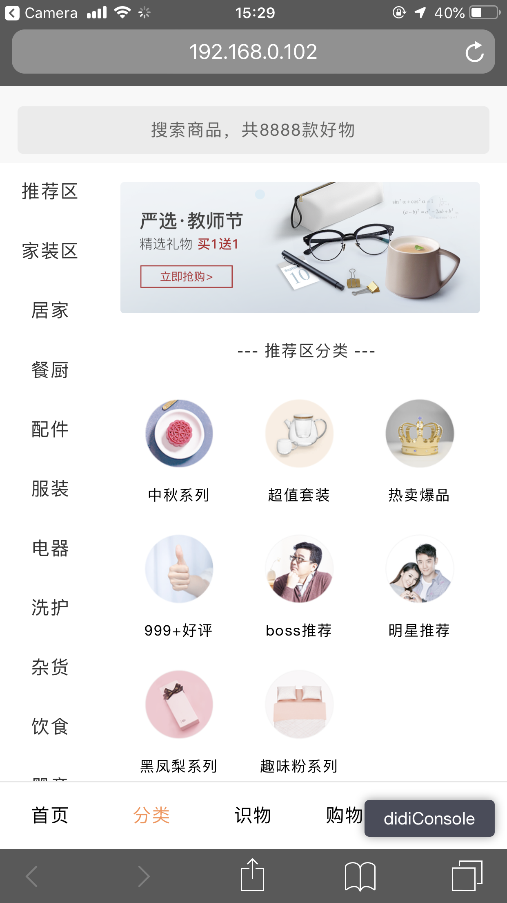 |  |  | |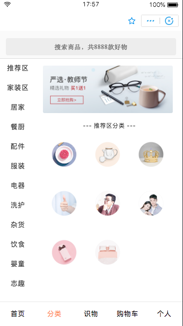 |
|  |  |  | | |
| 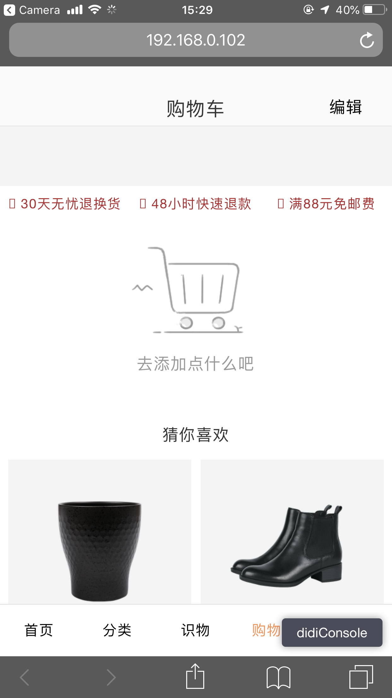 |  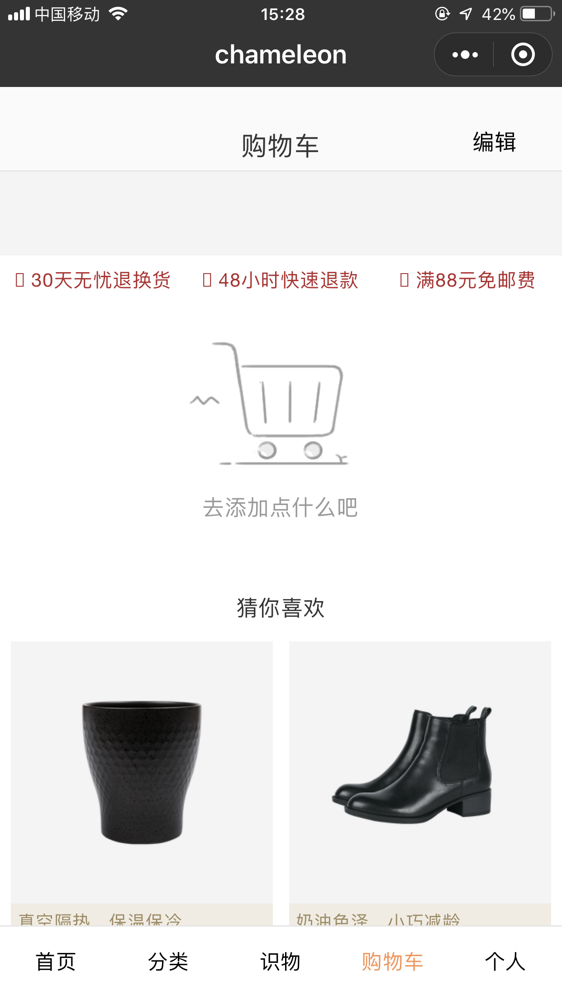|  |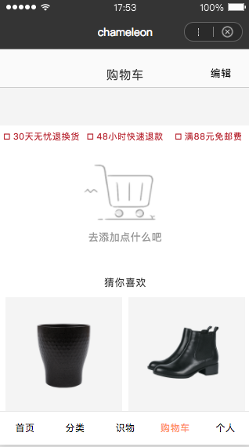 |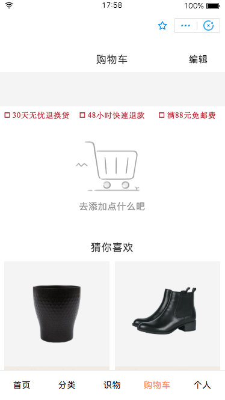 |
| 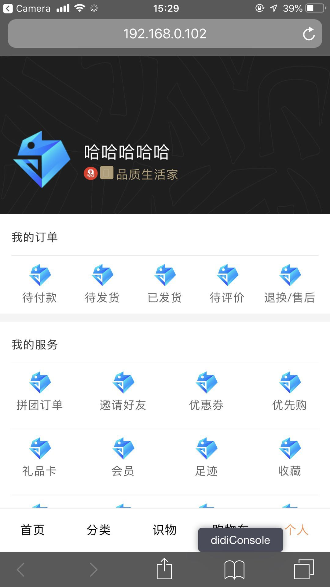 |  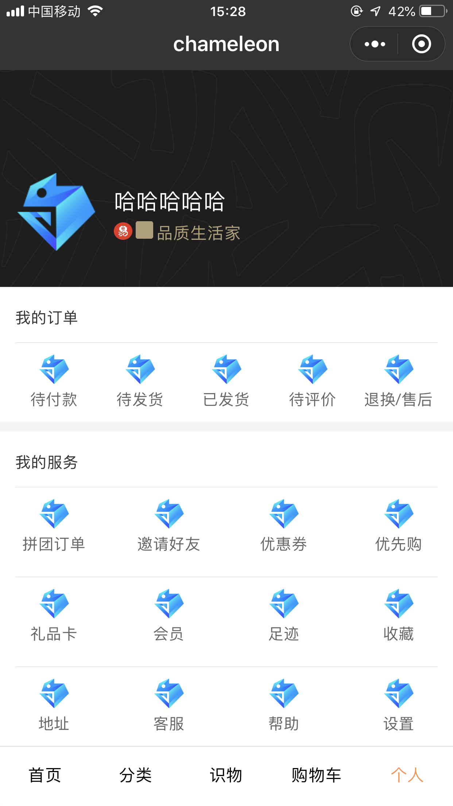| 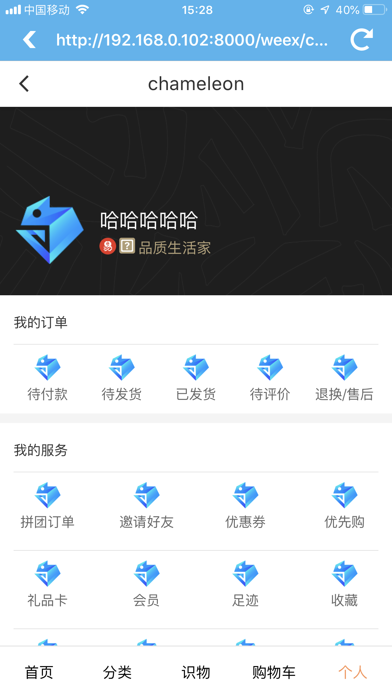 |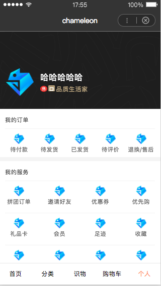 |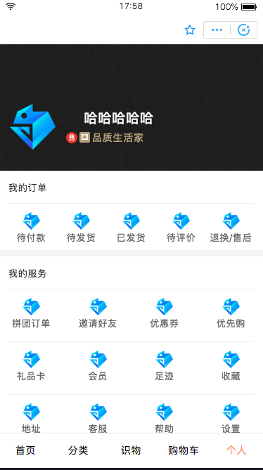 |
|  |  |  |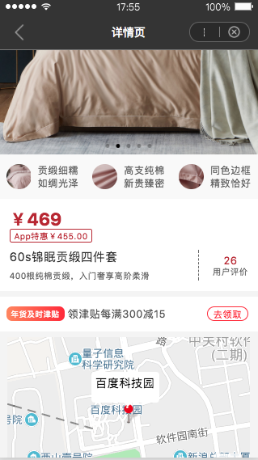 |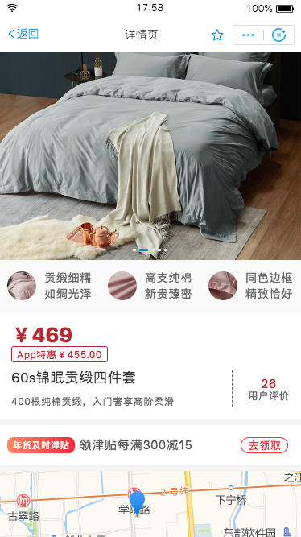 |

